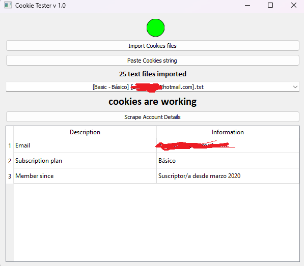
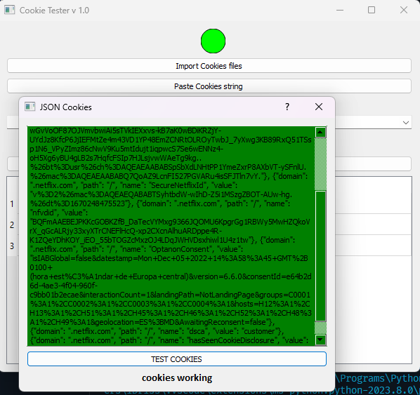
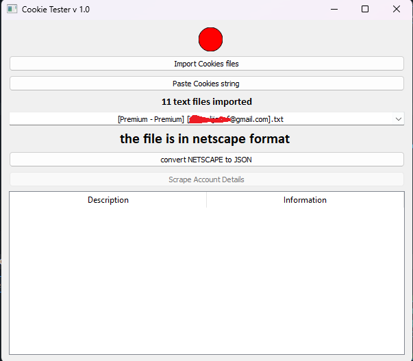

Cookie Tester
--------

WARNING: Use at your own risk. This tool is for educational purposes only.
The Cookie Tester is a Python-based tool that allows you to test  cookies to see if they are still valid and working. It also provides the ability to scrape account details from the account associated with the cookie.

Requirements

- Python 3.x
- PyQt5
- requests

Installation
------------------------
Clone the repository to your local machine.

Install the required packages by running the following command in your terminal: 
,,,
pip install -r requirements.txt
,,,

Usage

Launch the tool by running the following command in your terminal: 
,,,
python cookie_tester.py
,,,
Click the "Import Cookies" button to select the text file containing the  cookie(s) you want to test.
Click the "Scrape Account Details" button to test the cookies and scrape the associated account details.
The tool will display the number of non-working cookies and the associated account details (if available) in a table.
How it works
The  Cookie Tester works by testing the validity of the cookie(s) provided by the user. It does this by sending a GET request to the  homepage with the cookie(s) attached to the request. If the response contains the text "Who's watching?", the cookie(s) are considered valid.
If the cookie(s) are valid, the tool then sends a GET request to the account page with the cookie(s) attached to the request. It then scrapes the HTML response for the associated account details, such as the email address, subscription plan, next billing date, quality, and member since date.

Contributing

Contributions to the Cookie Tester are welcome! If you find a bug or have an idea for a new feature, please open an issue or submit a pull request.

License

The Cookie Tester is licensed under the MIT License. See the LICENSE file for more information.
